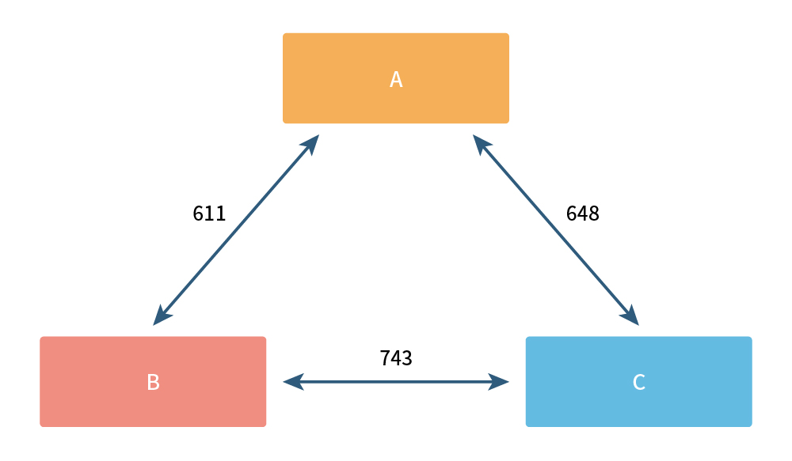
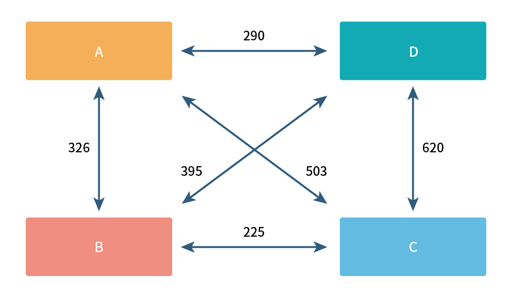

# QUIZ 

## 0. About Metaverse(Required)
사전적 의미가 아닌 지원자가 생각하는 메타버스(Metaverse)란 무엇인지 주요 특징(Key feature)를 3개 이상 작성하고, 
각각 이유와 기술 융합 방향성에 대해 작성하세요. (500자 내외)

## 1. Syntax Checker (Required)

괄호가 올바르게 쓰였는지 확인하는 로직을 만들려고 합니다. 
괄호는 대괄호, 중괄호, 소괄호 세가지가 있으며 주어지는 스트링이 괄호가 올바르게 사용되었으며 true, 아니면 false를 리턴하는 함수를 작성하세요.
예시: 
| input          | output                                     |
|----------------|--------------------------------------------|
| [[(){}]]       | true                                       |
| (()))          | false                                      |
| )(())[]{}      | false                                      |
| ({[}])         | false                                      |
| [{(([{[]}]))}] | true                                       |

## 2. Raccoon (Required)
너구리 한 쌍은 한 달 후에 다른 새끼 너구리 한 쌍을 낳습니다. 
이 새끼 너구리 한 쌍은 한 달 동안 성체가 되며 성체가 된 너구리 한 쌍은 다시 한 달 후에 다른 새끼 너구리 한 쌍을 낳습니다. 
이미 성체가 된 너구리 부부는 달마다 새끼 너구리를 한 쌍씩 낳는다고 가정할 때, n달 후의 너구리 수를 구하는 함수를 작성하세요. 
(단, 이 너구리들은 죽지 않습니다.)

예시:
| input(n달후)   | output(마리 수)                            |
|----------------|--------------------------------------------|
| 0              | 2                                          |
| 1              | 4                                          |
| 4              | 16                                         |

## 3. 집뷰가 필요한 이유 (Optional)
오프라인 매장이 문을 닫아서 상담원들은 직접 고객을 만나러 각지를 방문해야 하는 상황이 되었습니다. 
이들이 최소한의 이동시간으로 고객을 만날 수 있도록 최소 이동시간을 구하는 함수를 작성하세요. 
입력은 고객 수만큼의 방문지 리스트가 주어지며, 각 방문지에서는 다른 방문지로 이동할 시에 소요되는 이동시간이 다시 리스트로 주어집니다.
(단, 방문지의 수는 10명 미만으로 주어집니다)
예시:
[
    [0,  611,  648],
    [611,  0,  743], 
    [648, 743, 0]
]

정답: 1259

[
    [0, 326, 503, 290],
    [326, 0, 225, 395], 
    [503, 225, 0, 620], 
    [290, 395, 620, 0]
]

정답: 841

## 4. 아래의 문제를 요건에 맞춰 자유롭게 코드로 작성해주세요. (Only EngineTeam Required)
1. 인자로 전달받은 양의 정수 N보다 작은 모든 소수의 합을 반환하는 함수를 작성해주세요.
2. 멀티스레드를 이용해주세요.
3. c++로 작성해주세요.
  ```
  unsigned int SumOfAllPrimeNumbersLessThan(unsigned int N)
   {
	return 0;
   }
   ```
